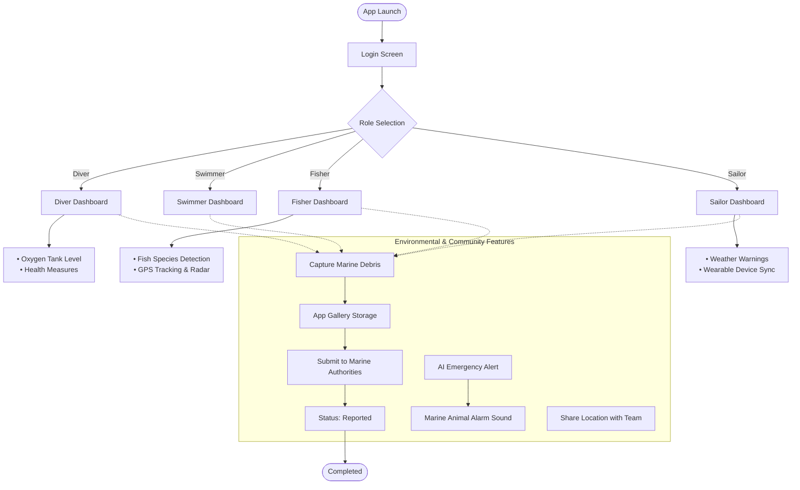

```markdown
# 🌊 Marine Safety & Environmental Support Mobile App
> **Coursework Project: UI/UX Design & Cloud Architecture (Azure)**

## 🔄 App Workflow & User Journey

The diagram below illustrates the overall application workflow, from role-based authentication to specialized features and marine environmental reporting systems.



## 📱 Figma Screen Breakdown (UI/UX Prototype)

The interactive UI/UX prototype designed in Figma consists of the following key screens:

* **Screen 1: Role Selection Login** — Features the application logo and four intuitive selection buttons corresponding to the user groups: *Diver*, *Swimmer*, *Fisher*, and *Sailor*.
* **Screen 2: Diver Dashboard** — Displays real-time biometric and environmental metrics, such as oxygen tank level, blood pressure, and pulse rate.
* **Screen 3: Fisher Radar & Tracking** — Integrates features for detecting nearby fish species, GPS coordinate tracking, and radar navigation.
* **Screen 4: Marine Debris Capture** — Provides a camera interface allowing users to capture photos of floating plastic waste or marine pollution with automated geolocation tagging.
* **Screen 5: Gallery & Reporting Status** — Displays a grid-based gallery of captured debris images, along with details of the designated marine authorities and a status label updated to *"Reported"*.
* **Screen 6: Weather & Emergency Alerts** — Provides pre-departure storm warnings, an emergency siren trigger for dangerous marine wildlife, and wearable device connectivity status.

## 🛠️ Tech Stack & Tools Used

* **UI/UX Design & Prototype:** Figma (Interactive high-fidelity prototypes).
* **Cloud Architecture:** Microsoft Azure (Azure Blob Storage for debris images & Database for reporting status).
* **Documentation & Version Control:** GitHub Markdown & Mermaid.js.

```

```
